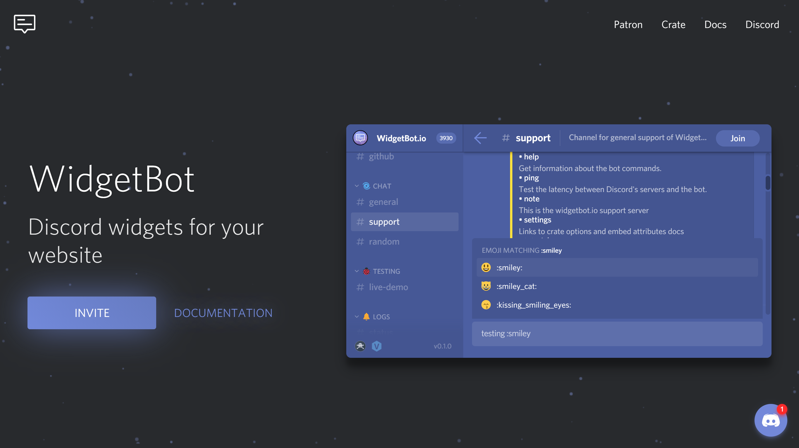

# [WidgetBot](https://widgetbot.io)   

 This work is licensed under a <a rel="license" href="http://creativecommons.org/licenses/by-nc-sa/4.0/">Creative Commons Attribution-NonCommercial-ShareAlike 4.0 International License</a>.

> WidgetBot is a pixel-perfect open-source Discord chat widget for your website.

| @widgetbot/                                                    | Description                         |                                                      |                                                  |
| -------------------------------------------------------------- | ----------------------------------- | ---------------------------------------------------- | ------------------------------------------------ |
| [embed](https://widgetbot.io)                                  | ReactJS widget client               | [Docs](https://docs.widgetbot.io/embed/)             | [/packages/embed/](/packages/embed/)             |
| [crate](http://npmjs.com/package/@widgetbot/crate)             | JS library that provides popup chat | [Docs](https://docs.widgetbot.io/embed/crate/)       | [/packages/crate/](/packages/crate/)             |
| [react-embed](http://npmjs.com/package/@widgetbot/react-embed) | React component for the embed       | [Docs](https://docs.widgetbot.io/embed/react-embed/) | [/packages/react-embed/](/packages/react-embed/) |
| [html-embed](http://npmjs.com/package/@widgetbot/html-embed)   | HTML element for the embed          | [Docs](https://docs.widgetbot.io/embed/html-embed/)  | [/packages/html-embed/](/packages/html-embed/)   |
| [embed-api](http://npmjs.com/package/@widgetbot/embed-api)     | Embed GraphQL JS API                | [Docs](https://docs.widgetbot.io/embed/embed-api/)   | [/packages/embed-api/](/packages/embed-api/)     |

## Getting started

**Requirements:**

- Node.js 10+
- Yarn

## Embed

The embed is mostly React.JS with Typescript.

- [React.js](https://reactjs.org) for describing the UI
- [apollo-client](npmjs.com/package/apollo-client) and GraphQL for data fetching
- [Mobx](https://mobx.js.org/) and [mobx-state-tree](https://github.com/mobxjs/mobx-state-tree) for state management
- [Emotion](https://emotion.sh) for styling components
